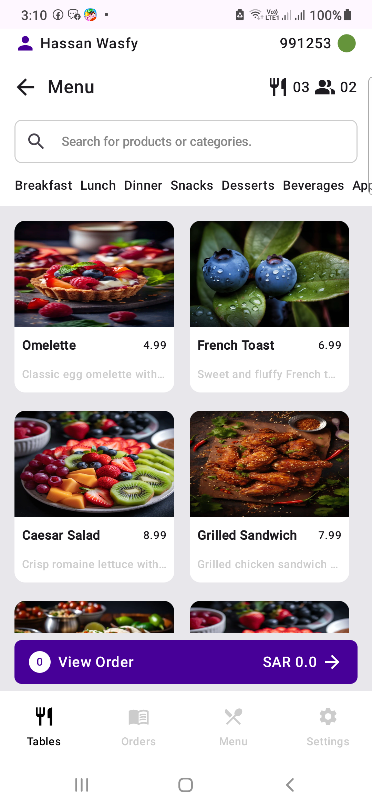
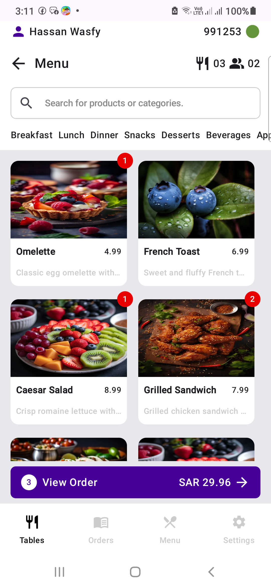
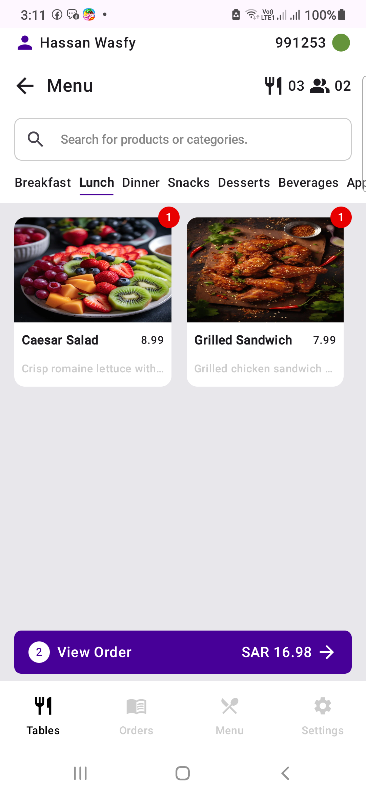
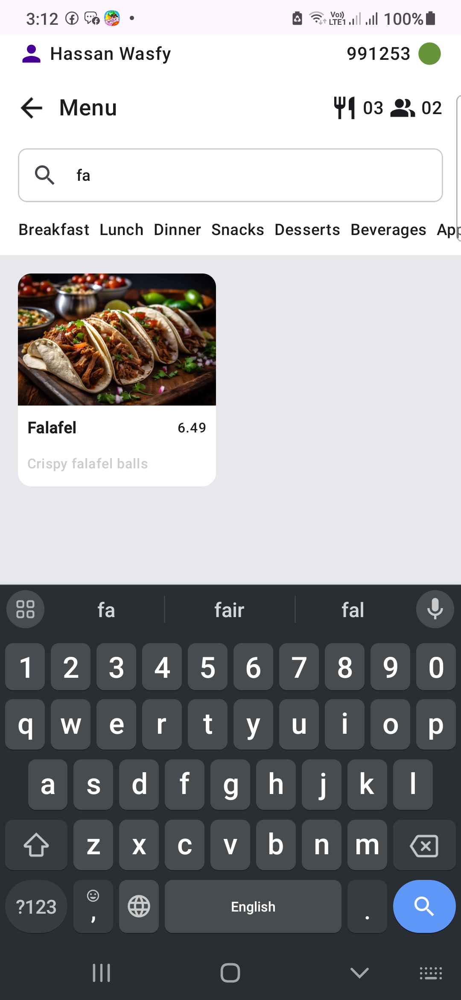

# Foodics Interview Task Showcase

This repository showcases the implementation of the Foodics interview task. It demonstrates modern Android development practices using **Kotlin**, **Jetpack Compose**, and various state-of-the-art libraries.

---

## Table of Contents

1. [Tech Stack](#tech-stack)
2. [App Content](#app-content)
3. [Features](#features)
4. [How to Run](#how-to-run)
5. [Screenshots](#screenshots)
6. [Contact](#contact)

---

## Tech Stack

This project leverages the following technologies:

- **Kotlin**: Modern, concise, and safe programming language for Android development.
- **Jetpack Compose**: Android's modern UI toolkit for building declarative, intuitive, and responsive user interfaces.
  - [Jetpack Compose Documentation](https://developer.android.com/jetpack/compose)
- **Koin**: Dependency injection framework for Kotlin applications.
  - [Koin Documentation](https://insert-koin.io/)
- **Ktor**: Framework for making HTTP network calls.
  - [Ktor Documentation](https://ktor.io/)
- **Room**: Jetpack library for SQLite database management.
  - [Room Documentation](https://developer.android.com/training/data-storage/room)
- **Coil**: Image loading library for Android backed by Kotlin coroutines.
  - [Coil Documentation](https://coil-kt.github.io/coil/)
- **Kotlin Flow**: In coroutines, a flow is a type that can emit multiple values sequentially.
  - [Android Kotlin Flow](https://developer.android.com/kotlin/flow)
- **Other Jetpack Libraries**: Includes Navigation, ViewModel, LiveData, and more.
  - [Jetpack Overview](https://developer.android.com/jetpack)

---

## App Content

The app contains 4 main screens:

1. **Products**:
   - Fully implemented.
   - Allows users to view products, add them to an order, increase their count, and calculate the total price.

2. **Orders**:
   - Placeholder screen.

3. **Menu**:
   - Placeholder screen.

4. **Settings**:
   - Placeholder screen.

---

## Features

### 1. Data Fetching and Caching
- Fetches product data from a network API using **Ktor**.
- Caches the fetched data in a **Room** database for offline access.

### 2. Product Ordering
- Users can:
  - Search products.
  - Select products.
  - Add product counts.
  - Automatically calculate the total price of the order.

### 3. Modern UI Design
- Built entirely with **Jetpack Compose** for a responsive and modern user experience.
- Uses **Coil** for efficient image loading and rendering.

---

## How to Run

1. Clone the repository:
   ```bash
   git clone https://github.com/your-username/foodics-task-showcase.git
   cd foodics-task-showcase
   ```

2. Open the project in **Android Studio**.

3. Add the API key to the `local.properties` file:
   ```bash
   API_KEY=fa990d98-3414-4e32-9815-d8942fb42dc6
   ```
   
4. Ensure you have the required dependencies installed. Run:
   ```bash
   ./gradlew dependencies
   ```

5. Build and run the project:
   ```bash
   ./gradlew assembleDebug
   ```

---

## Screenshots
- **Product List**






---

## Contact

For any queries or clarifications, feel free to reach out via:
- **Whatsapp**:
    - [Send a Message](https://wa.me/+201508043285)
- **LinkedIn**:
    - [Send a Connection](https://www.linkedin.com/in/hassanwasfy7/)
---
